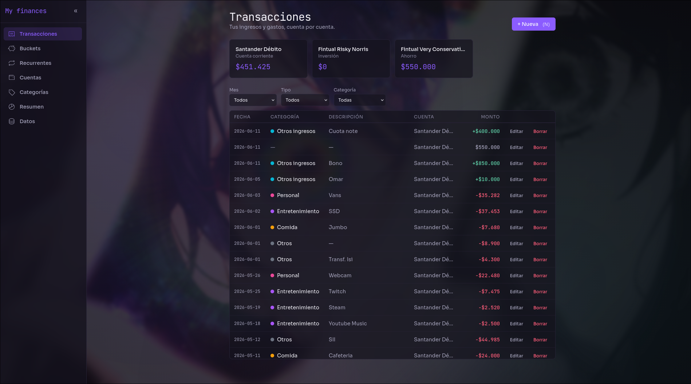
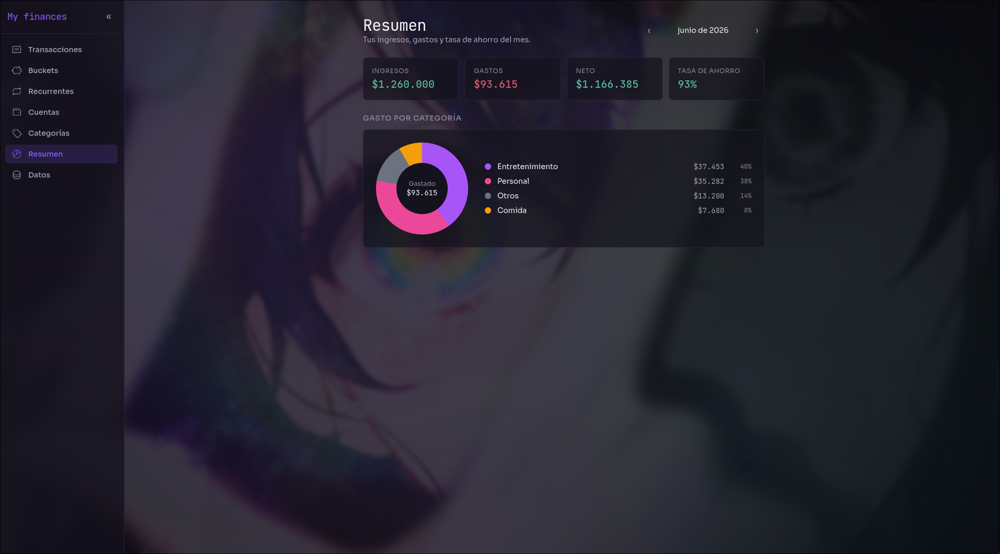
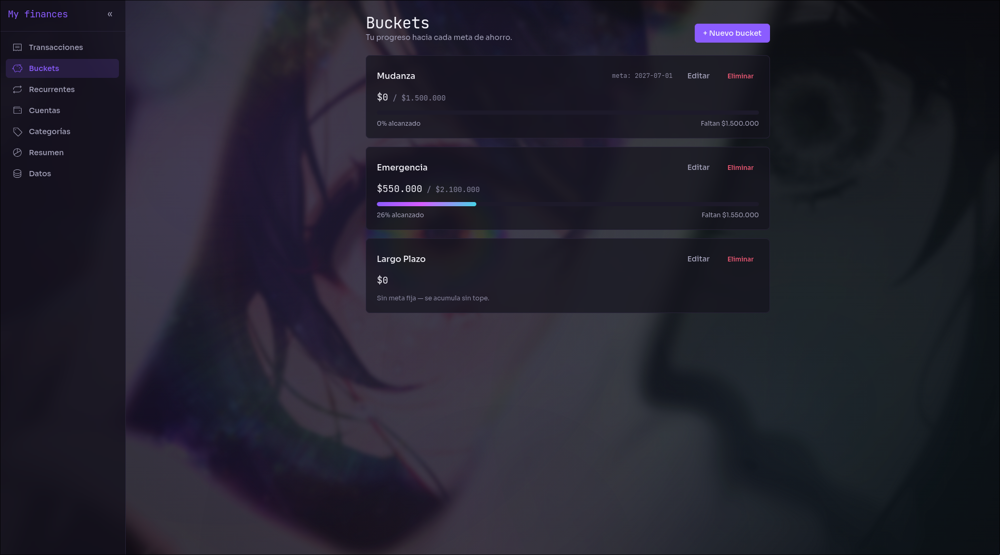

# my-finanzas

Aplicación personal para rastrear finanzas: ingresos, gastos, transferencias entre cuentas y aportes recurrentes. Diseñada para uso local desde el escritorio (Windows + WSL), single-user, sin nube.

## Pantallas

| Transacciones | Resumen mensual |
|---|---|
|  |  |

| Buckets de ahorro | Aportes recurrentes |
|---|---|
|  |  |

## Funcionalidades

- **Transacciones** — registro de ingresos, gastos y transferencias entre cuentas; tabla virtualizada con filtros por mes, tipo y categoría
- **Cuentas** — balance derivado de transacciones (nunca editado directamente); soporte para CLP y UF
- **Buckets de ahorro** — metas con progreso visual, fecha objetivo y cuenta vinculada
- **Aportes recurrentes** — transferencias programadas por día del mes con confirmación manual; estado pendiente derivado (no almacenado)
- **Resumen mensual** — ingresos, gastos, neto y tasa de ahorro; desglose por categoría con gráfico de dona
- **Categorías** — etiquetas de gasto/ingreso con color personalizable
- **Datos** — respaldo de base de datos y exportación de transacciones a CSV

## Stack

| Capa         | Tecnologías                                                                                      |
| ------------ | ------------------------------------------------------------------------------------------------ |
| Frontend     | Vite 6, React 19, TypeScript, Tailwind CSS v4, Zustand, React Router v7, Vitest, Testing Library |
| Backend      | Node 20+, Express 5, TypeScript, Zod, Vitest, supertest                                          |
| Persistencia | SQLite (`better-sqlite3`) + Drizzle ORM — archivo único `backend/data/finanzas.db`               |
| Tooling      | ESLint, Prettier, EditorConfig                                                                   |

## Arquitectura

El backend sigue una **Clean Architecture liviana** organizada por feature (`account`, `transaction`, `bucket`, `recurring`, `category`). Cada feature expone su entidad, su interfaz de repositorio y sus errores de dominio; la infraestructura (Express + Drizzle) implementa esas interfaces sin contaminar el dominio con dependencias externas.

El frontend usa **Atomic Design** (`atoms → molecules → organisms → templates → pages`) con estado global en Zustand y acceso a la API desacoplado en clientes por feature.

```
my-finanzas/
├── backend/
│   └── src/
│       ├── domain/         entidades + interfaces de repositorio, por feature
│       ├── application/    casos de uso, por feature
│       ├── infrastructure/ HTTP (Express) + persistencia (SQLite/Drizzle)
│       └── shared/         schemas Zod, utilidades
├── frontend/
│   └── src/
│       ├── components/     atoms / molecules / organisms / templates
│       ├── pages/          containers de cada vista
│       ├── hooks/          lógica de UI por feature
│       ├── stores/         Zustand stores
│       └── api/            cliente HTTP por feature
└── scripts/
    └── start-app.sh        arranca backend + frontend juntos
```

## Requisitos

- Node.js >= 20
- pnpm >= 10 (`npm i -g pnpm` o `corepack enable`)
- WSL2 (Ubuntu) si estás en Windows

## Instalación

```bash
cd backend  && pnpm install
cd ../frontend && pnpm install
```

La base de datos SQLite se crea automáticamente en `backend/data/finanzas.db` la primera vez que arranca el backend.

## Arranque

```bash
./scripts/start-app.sh
# abre el browser automáticamente:
./scripts/start-app.sh --open
```

- Backend: `http://localhost:4001`
- Frontend: `http://localhost:5174`

`Ctrl+C` apaga ambos limpiamente.

## Tests

```bash
cd backend  && pnpm test
cd frontend && pnpm test
```

## Base de datos

```bash
# generar migración tras cambiar el schema
cd backend && pnpm db:generate
# aplicar migraciones pendientes
cd backend && pnpm db:migrate
```

## Variables de entorno

| Variable                    | Default                 | Descripción               |
| --------------------------- | ----------------------- | ------------------------- |
| `PORT` (backend)            | `4001`                  | Puerto del API            |
| `FRONTEND_ORIGIN` (backend) | `http://localhost:5174` | Origen permitido por CORS |
| `DB_PATH` (backend)         | `data/finanzas.db`      | Ruta del archivo SQLite   |

## Convenciones

- TypeScript estricto (`strict: true`, `exactOptionalPropertyTypes: true`, `noUncheckedIndexedAccess: true`)
- Dominio organizado por feature; tests cohabitan con el código (`Foo.ts` ↔ `Foo.test.ts`)
- Commits convencionales (`feat:`, `fix:`, `refactor:`, `test:`, `chore:`)
- Imports absolutos con alias `@/`
